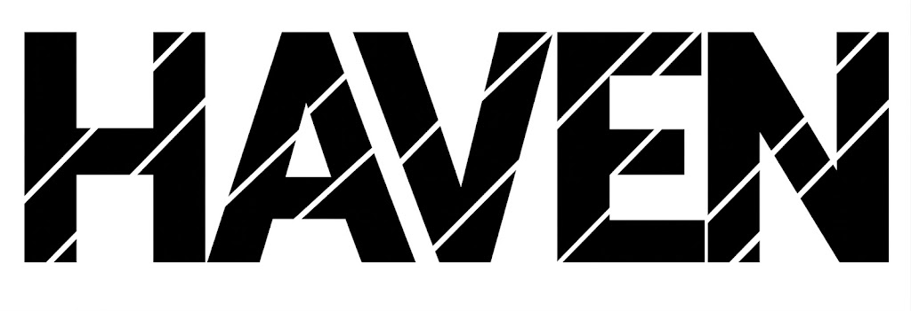
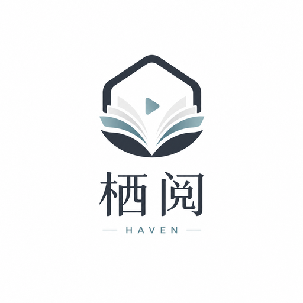

<div align="center">
  

  

  <h1>栖阅 Haven</h1>

  <p>一个本地优先、面向 Windows 的个人内容空间，让所有故事在一个地方继续。</p>

  <p>
    <a href="https://github.com/Knight-ask-art/Haven">GitHub</a>
    · <a href="LICENSE">MIT License</a>
  </p>

  <p>
    
    
    
    
    <a href="LICENSE"></a>
  </p>
</div>

## Overview

Haven（中文名：栖阅）是一个 Local-first 桌面阅读与媒体库工具。文件、进度、收藏、历史、标记和设置由本机 Rust + SQLite 负责，React 只负责交互和展示。网络来源、远程图片和外部 Provider 都经过受控的来源、资源和安全策略；没有账号也可以使用本地核心能力。

当前主线是 `v0.1.0` Windows Local Core。项目内部的任务台账、验收记录和发布跟踪不随公开仓库分发；公开仓库只包含可运行产品、构建配置和必要的公开契约样例。

## Core capabilities

- 本地目录登记、扫描、SQLite 媒体库和 Work → Edition → MediaItem 路由。
- 视频、TXT/Markdown/EPUB/PDF/HTML 阅读与受控 Session Resource；PDF 使用本地打包的 PDF.js。
- CBZ 与图片目录的受控漫画页面协议，支持单页、双页、条漫、RTL/LTR、预加载和坏页隔离。
- 收藏、进度、播放/阅读历史、标记和资源级 Reading/Comic 偏好，支持 CAS 与关闭后重启恢复。
- 本地全文搜索、来源注册与真实来源搜索；搜索失败以 Partial/可重试状态呈现。
- 本地 Offline Download、队列操作、重启恢复、软限速、空间准入和统一 Notice Center。
- Artwork Cache、默认封面 fallback、离线读取和缓存自愈；前端不直接请求第三方海报。
- 严格 CSP、最小 Tauri Capability、命令清单/ACL 一致性检查和脱敏日志。
- 播放器 `Ctrl+Shift+S` 截图：受限 JPEG 分块上传，Windows 原生保存对话框，默认保存到“下载 / 栖阅 / 截图”。
- 设置页的 General、Appearance、Playback、Reading、Comic、Downloads、Privacy、Sources、Storage、Updates 和 About 真实数据闭环；AI、Sync 等未接入分区会明确显示不可用，未配置签名发布时更新安装也会安全显示不可用。

## Architecture

```text
React UI
  -> Feature Hook / Action
  -> Typed HavenClient
  -> Tauri Command
  -> Application Service
  -> Domain / Repository Port
  -> Infrastructure (SQLite, files, network, Windows)
```

Rust + SQLite 是持久化事实源。前端的 Mock 只在显式浏览器开发模式存在；独立 Tauri custom-protocol 构建不会回退到演示数据。图片字节、视频帧、PDF 页面和漫画原图不进入 JSON IPC，而是使用受控资源协议或有界上传。

## Supported formats and boundaries

首发目标是 Windows 本地内容核心：视频、TXT、Markdown、EPUB、PDF、HTML、CBZ 和图片目录。支持范围、已知限制和升级说明请参阅[公开变更记录](CHANGELOG.md)。

当前明确不提供：外挂字幕、音轨切换、HEVC 控制；OCR/翻译/AI、Sync 和“清除全部本地数据”需要独立 Foundation/风险评审后再开放。自动更新已经接入 Tauri 官方签名更新链，但必须由维护者配置签名私钥并发布 GitHub Release 后才会提供可安装版本；长时间播放、1000 页 EPUB/漫画和 Downloads Worker 的极限稳定性保留为用户反馈阶段，不会在没有证据时写成保证。

## Quick start (Windows)

安装 Node.js 22、仓库锁定的 Rust 1.94.1 和 Tauri 2 所需的 Windows 构建工具后：

```powershell
cd 前端/app
npm install
npm run dev
```

构建可独立启动的 custom-protocol 调试程序（不依赖 `localhost:1420`）：

```powershell
cd 前端/app
npm run build
cd ../../src-tauri
cargo build --locked --features custom-protocol
```

也可以在仓库根目录运行 `.\build.ps1` 一键完成依赖安装、前端构建和 Tauri 构建；已有依赖时可使用 `.\build.ps1 -SkipInstall`。

浏览器 Preview 只验证 Mock/不可用分支，不能替代真实 Tauri、SQLite、Windows 权限或重启恢复验收。

## Development checks

公开发布流水线只运行构建所需的静态检查和构建步骤；本地测试源码、验收记录和诊断输出不随仓库分发。

```powershell
cd 前端/app
npm run ci:check

cd ../../后端
cargo fmt --all -- --check
cargo clippy --workspace --all-targets -- -D warnings
cargo build --workspace

cd ../src-tauri
cargo fmt --all -- --check
cargo clippy --all-targets -- -D warnings
cargo build --locked --features custom-protocol
```

## Diagnostics and issue reports

设置页提供脱敏诊断报告预览和本地导出。报告只包含报告 ID、版本/系统/运行模式、稳定错误码和经过脱敏的有限日志；不会包含数据库、媒体文件、正文、搜索词、Cookie、Token、Signed URL、完整 URL 或绝对路径。用户确认后可以打开固定的 Haven GitHub Issue 模板，并在页面中手动附加导出的报告。

Haven 不会在没有用户授权的情况下保存或发送 GitHub Token。发现安全问题请阅读 [SECURITY.md](SECURITY.md)，不要在公开 Issue 中粘贴凭据或完整诊断导出。

## Updates

Tauri 桌面版本已经接入固定的 HTTPS GitHub Release 检查链；在维护者配置签名私钥并发布签名 Release 前，v0.1.0 设置页只显示“更新不可用/检查失败”，不会安装未签名文件。正式开放后，用户确认才会安装由 Tauri Updater 校验 minisign 签名的 Windows 被动更新包；签名私钥只配置在 GitHub Actions Secret，仓库不保存私钥。

## Documentation

- [公开变更记录](CHANGELOG.md)
- [内置来源能力表](SOURCES.md)
- [第三方许可说明](THIRD_PARTY_NOTICES.md)

## License

Haven 自有代码以 [MIT License](LICENSE) 发布。第三方依赖、Live2D 模型和运行时仍受各自许可证与 [THIRD_PARTY_NOTICES.md](THIRD_PARTY_NOTICES.md) 约束；发布制品会重新核对 Notice、许可证文本和资源 Hash。
